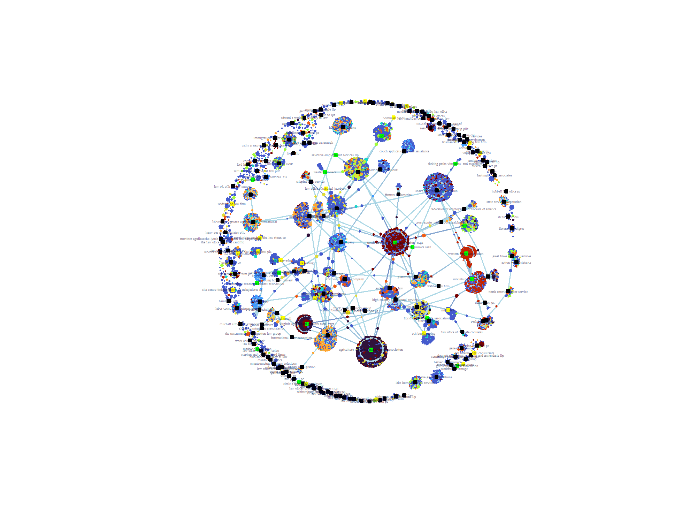
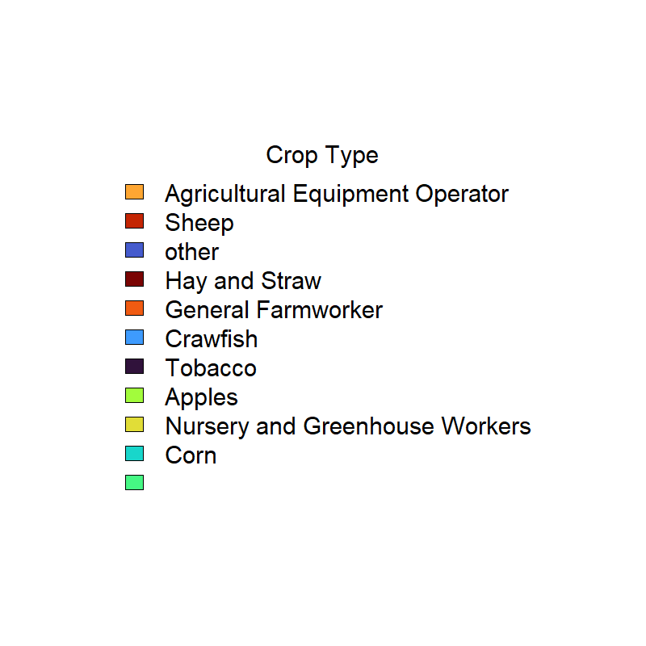

```{r setup, include=FALSE}
knitr::opts_chunk$set(echo = TRUE)
```

# Computational Sociology Field Exam 7/12/24

```{r}
# Packages
library(igraph)
library(tnet)

```

## INTRO

For this exam I am going to look at a certification database from the H2A visa program. The H2A program provides short-term visas for foreign agricultural workers. Employers, referred to as farms for the rest of this notebook, must request visas from the Department of Labor through a certification process. The dataset below includes all applications by farms in FY2016. Farms can submit multiple applications a year, with a unique 'case_number' including information about that application. The database contains information on the name of the farm/business requesting labor, the number of workers requested, daily activities, crop type, wage rate, geographic information on the worksite, whether it is a joint application where employers move to different farms, and more. 

Due to the legal complexity of filling out H2A certification information, and the more difficult process of actually finding suitable foreign workers, most farms elect to use an "agent," who recruits workers, sometimes supervises/houses guestworkers, and provide a whole suite of other services on behalf of farms. These "agents," or brokers, associations, labor contractors, function as the engine of the H2A system; effectively matching guestworkers with farms in need of labor in the US.

Applicants in the H2A certification database are required to disclose whether they used an agent, and provide some basic information about the agent (whether it is a for-profit labor contractor, a non-profit growers' association, a local lawfirm, as well as some geographic information). 

The connections between individuals farms and agents in the H2A database thus approximates a bipartite affiliation network, with farms as one mode and agents as another; due to the structure of the dataset, there are no ties between farms or between agents. The actual structure of the affiliation network for a cross-section will have fairly few ties in the one-mode projection of agents, as for each application a farm only lists a single agent (or no agent). The only cases where agents are connected (in a 2 path), are when a farm files multiple applications in a year, with varying agents - however, this happens quite rarely in a given year. 

The goal of this analysis is to use a bipartite ergm to understand some of the tie formation processes between farms and agents; that is, what are the features of farms and agents (and the overall network structure) that explain a farms' modality of obtaining guestworkers. 


First, load in the datasets
```{r}
# Load in datasets; node-level and attributes
df <- read_csv("pre_adj_matrix.csv")
attributes <- read.csv("attributes.csv")
head(df)
```
The pre-adjacency matrix is a cleaned dataframe that includes a cluster_id (representing the employer) with the number of applications the employer made corresponding to the number of duplicate cluster_ids, and the agent_id corresponding to the agent listed for each application the employer made. 

Next let's load in the attributes table
```{r}
head(attributes)
```
The attribute table is a condensed tidy dataframe by unique employer and unique agent. As some employers had multiple applications in FY2016, to get this a tidydata frame I had to do the equivalent of a gather() function, condensing the dataframe by unique employer/agent. To do so, I took the 'mode' of most attributes, like crop_type, location, and experience required. For example, if a farm submitted 3 applications in FY2016 with varying attribute type, I took the most commonly occurring value per attribute (like the most frequent crop type a farm submitted an application for). I also took the sum of the total number of workers a farm requested and the mean wage.

Now lets convert the pre-adjacency matrix to a weighted adjacency matrix to fit into the network
```{r}
# Convert node-level data to a weighted biadjacency matrix
adj_matrix <- as.data.frame.matrix(table(df))
```
The weights here represent the number of applications a farm did with an agent in FY2016, with one application with an agent representing a tie between farm and agent. 


Using igraph, I convert the adjacency matrix to a graph object.
```{r}
#Create network object
net <- graph_from_biadjacency_matrix(adj_matrix, mode = "all", weighted = TRUE)
```

```{r}
net
```


The network is specified correctly here, a bipartite undirected network with 6998 nodes and 6572 edges. In the "visualization.Rmd" section, I created the following graph representing the network:

```{r pressure, echo=FALSE, fig.cap="A caption", out.width = '100%'}

```

```{r pressure, echo=FALSE, fig.cap="A caption", out.width = '50%'}

```

In the above graph, square nodes represent agents while circles represent farms, Green squares represent associations, yellow squares represent labor associations, and black squares represent individual agents. Circle color is the primary crop type of the farm, given by the legend. The size of the circle node is a weighted measure of the number of workers the farm requested in FY2016. The hue of the edge color signifies weight; with darker blue edges indicating more repeat applications between the same farm and broker. 

The network structure seems to confirm priors. Edges are mostly clustered around single agents as isolated cliques, with a few edges connected cliques. Larger agents (who work with many farms), seem to be apart of the large partition in the center, which have some shared farms. A large proportion of agents and farms remain unconnected to this large, central partition - especially smaller agent-farm pairs of 1 or 2. The most connected agents appear to be associations (as shown by their central position in the graph), while labor contractors and individual agents tend to be isolated on the periphery.

There also appears to be a strong homophily/clustering effect by crop type; farms of the same crop type seem to work with the same brokers. Noticeably, farms who specialize in sheep tend to work with Western Range Association. The same appears true of apples and hay/straw. Individual agents (represented by black squares), seem like they are more variegated in terms of crop type by the farms they work with than associations and labor contractors. 

Finally, there is a significant contingent of disconnected farms that do not work with any labor broker (show by circles without edges). These farms tend to be small in terms of the number of workers requested, compared to larger farms in the connected core. 

## SECTION 1

Let's do a quick analysis on the one mode projections of the affiliation network, and then compare features to the bipartite.

First, let's examine the farm-farm one-mode projection
```{r}
# extract one mode project by farm 
onemode <- bipartite_projection(net)
farm_farm <- onemode$proj1
```


```{r}
farm_farm
```
The resulting one-mode projection is an undirected weighted network with 6797 nodes and 858,649 edges.


The edgeweight values of the matrix represent the number of applications with agents the farms have in common.

Now let's run some tests on the one-mode farm to farm graph object;
```{r}
#Standardize edge weights
weights <- E(farm_farm)$weight
scaled_weights <- weights/sd(weights)
```


Let's examine degree; or the number of weighted edges a farm has
```{r}
#weighted degree
deg_scaled <- strength(farm_farm, mode = "all", weights = scaled_weights)
deg_data <- data.frame(deg_scaled)

head(deg_data %>%
  arrange(desc(deg_scaled)))
```
Looks like triple b farms, triple r farms, and triple c farms all among the most central (they have to be the same employer, right?). An inspection of the dataframe shows that these farms used 3-4 different agents in FY2016, all of which were among the largest/most connected agents. 

Let's look at the least connected edges next:
```{r}
head(deg_data %>%
  arrange(-desc(deg_scaled)))

```
These farms are a subset of the many disconnected farms (degree of 0), who do not use (or list) an agent in their application.


Let's see what features are associated with network centrality:

```{r}
# Add attributes into network;

#remove na rows
attributes <- attributes[!is.na(attributes$name), ]

#a helper function to set vertex attributes according to the attribute df
add_attributes <- function(network, df, value){
  set_vertex_attr(graph = network,
                  name = value,
                  value = df[[value]])
}

# create list of attribute column names (except for the columns name and type which are already in the network)
attribute_list <- attributes %>% colnames()
attribute_list <- setdiff(attribute_list, c("name", "type"))


# run function for network
for (i in attribute_list) {
  farm_farm <- add_attributes(net, attributes, i)
}


```


```{r}
is_farm <- (vertex_attr(net, "type") == FALSE)


# vector of crop_types by node
farm_crop_type <- V(farm_farm)$crop_type[is_farm]

# add to degree data
centrality_data <- data.frame(deg_data, farm_crop_type)
```
Now examine degree by crop type;

```{r}
aggregate(deg_scaled ~ farm_crop_type, data = centrality_data, FUN = mean)

```
```{r}
aggregate(deg_scaled ~ farm_crop_type, data = centrality_data, FUN = sd)

```

Looking at degree by crop type, it appears farms that produce hay and straw, tobacco, and sheep are most central to the network than more isolated/clustered crop types like apples, corn, crawfish. The higher degree crop types make sense; tobacco planting and hay/straw harvesting seem like more generalist activities - they work with many large agents who send out many requests. 

Crawfish, apples, corn, may exist in highly localized clusters, requiring skilled workers from a single, trusted agent, with agents perhaps more 'exclusive' about the network of farms they work with (and who send out fewer requests). 


## SECTION 2 - ERGM

Research question: What explains a farms' modality of acquiring H2A guestworkers? What type of farms are likely to work with what type of agents?

Farms have a few pathways in terms of their potential tie with an agent; they can do it by themselves, with no agent to facilitate (which implies either personal networks with recruiters/workers in the sending country or an in-house legal/recruitment apparatus). 

Farms might do a joint application with other farms for a single batch of guest-workers; perhaps to reduce costs, for short-term/irregular tasks, or staggered harvests. Farms might also become members of large, regional farmers associations which provide legal and recruitment services for acquiring H2A workers. Farms can also pay for the services of large agent, which accomplish similar goals as farmers associations, but are likely more heterogeneous in terms of location. Farms can work with H2A labor contractors, which also pool together workers to spread out across different farms. Lastly, farms can work with small lawfirms that provide legal services and work with only a few farms, while doing recruitment activities informally/in-house.

The goal is to see whether farms tend to have numerous acquisition pathways, or if they stick to one kind; and what are the features of the farms and agents, independently and jointly, that tend to produce the various worker acquisition pathways? 


```{r}
library(network)
library(ergm)
#library(tergm)
library(networkDynamic)
library(dplyr)
library(tidyverse)
```


Set up network and attributes:
```{r}
# Load in datasets; node-level and attributes
df <- read.csv("pre_adj_matrix.csv")
attributes <- read.csv("attributes.csv")
# Convert node-level data to a weighted biadjacency matrix
adj_matrix <- as.matrix(table(df))

```

clean attributes a bit
```{r}

#edit the organization_type column for easier analysis
attributes <- attributes %>% 
  mutate(joint_employer_flag = ifelse(joint_application > 0, "Y", "N" ),
         organization_type = ifelse(organization_type == 'joint', 'individual farm', organization_type),
         agent_type = ifelse(class == "agent", organization_type, NA),
         farm_type = ifelse(class=="employer", organization_type, NA),
         agt_primary_crop = ifelse(class == "agent", agent_type, crop_type),
         agt_joint_employer_flag = ifelse(class == "agent", agent_type, joint_employer_flag),
         agt_experience_required = ifelse(class == "agent", agent_type, EMP_EXPERIENCE_REQD)
         
  )

#remove na rows
attributes <- attributes[!is.na(attributes$name), ]
#create list of attribute names
attribute_list <- do.call(list, attributes)
```


Construct the network object
```{r}
net <- network(adj_matrix, bipartite = T, vertex.attr = attribute_list)
```


```{r}
net
```
The network is loaded in correctly; a weighted bipartite with 6998 vertices and 6572 edges


### MODEL 1 - Edges (Erdos-Renyi Model)

The simplest ERGM model (sometimes called M0) includes just a term for edges. In the bipartite model, edges are only possible between farms and agents

```{r}
model1 <- ergm(net ~ edges)
```
```{r}
summary(model1)

```
As there are no dyad-dependent terms, we can just do maximum likelihood, no need for MCMC simulation. 

The coefficient of edges can be interpreted as the baseline probability (log odds) of a tie existing; 

```{r}  
exp(-5.33215)/(1 + exp(-5.33215))
```
around 0.0048, or 0.5% of all possible edges in the network exist. This is just equivalent to the number of ties (non-zeros) in the adjacency matrix divided by the total number of possible ties (number of rows times number of columns). The result shows that edges are fairly rare in the network; however, this baseline does not accurately capture the actual possibilities of the network. The number of true edges possible in the dataset is a function of the total number of applications sent in by each node. Obviously, a farm cannot work with every single agent in the network in a year. In the next sections, we incorporate node-level attribute terms to better represent the network.


### MODEL 2 - Node-level terms

From the basic model of just edges, next I add in some node-level terms. Nodefactor terms add a statistic to the model which count the number of edges that nodes with a given attribute have.This essentially captures the difference in degree across nodes with varying attributes; for example, regional associations (agents) likely work with more farms (have more edges) than local law-firms. 

As opposed to a one-mode network, bipartite ergms require nodefactor terms on each mode. First, I include a nodefactor term for the agent type on the secondary mode, agent.


By default, attributes in factors are listed alphabetically;
```{r}
attributes$agent_type %>% as.factor() %>% summary()
```


Now lets run the M1 model, which includes node-level terms for nodefactor
```{r}

model2 <- ergm(net ~ edges +
                 b2factor("agent_type", levels = -2)) #set level -2 to force 'individual agent' 
                                                      #as the baseline category
```

```{r}
summary(model2)
```
With individual agent as the baseline category for b2factor.agent_type, we can interpret the model summary as follows; associations, with a significant positive coefficient of 1.69 will tend to be larger (have more ties/a larger probability of having a tie) than individual agents, while labor contractors with a negative significant of -0.798 coefficient of -0.798 tend to be smaller than individual agents. 

Specifically, this model suggests the odds of a farm sending in an application/working with a farmers association is 
```{r}
exp(1.68955)
```
higher than with an individual agent such as a local lawfirm or for-profit recruiter.

#### MODEL 2a

With degree/size controlled for in the network, we can now incorporate a homophily term for agent_type in the model. Homophily, which captures whether actors tend to form ties with other actors who share an attribute, is slightly more complicated in bipartite networks where there are no cross-mode ties. Instead, the homophily term is calculated by whether nodes sharing an attribute are linked together through another mode of type 2 (a two-path). 

In this model, keeping with analyzing mode2 (or agent-wise) nodes, the homophily term "b2nodematch" is on the type of agent; that is, do farms who work with a particular agent type (like associations, or FLCs), tend to work with other agents of the same type.

The actual function nodematch counts the number of two-paths on the attribute 'agent_type'. I selected a beta parameter of 0.25, which discounts additional two_paths of the same type, to avoid model degeneracy.

```{r}

model2a <- ergm(net ~ edges +
                 b2factor("agent_type", levels = -2) + 
                 b2nodematch("agent_type", beta = 0.25), control = control.ergm(MCMC.burnin = 20000, MCMC.samplesize = 3000))
```

```{r}
summary(model2a)
```
The b2nodematch term has a significant (and large) negative coefficient, indicating that farms who work with one type of agent are unlikely to match with other agents of the same type. This makes some contextual sense; perhaps farms use different types of agents for different reasons; either for a different crop type/worker required/service than provided by their other agent. This implies some form of monopolistic behavior by the type of agent; labor contractors, associations, and individual agents are unlikely to share clientele with agents of their similar type.

There also only 3 agent types; perhaps if a farm had worked with an association, there were no other associations around and had to switch to working with an individual/private agent. A temporal analysis might be useful to identify tie formation/dissolution processes. 

#### MODEL 2B

We can do the same node-level terms for mode1, or by farm. Let's first try by crop type:

```{r}
model2b <- ergm(net ~ edges +
                 b2factor("agent_type", levels = -2) + 
                 b2nodematch("agent_type", beta = 0.25) +
                 b1factor("crop_type", levels = -8) +  #set reference to 'other'
                 b1nodematch("crop_type", beta = 0.25),
                estimate = "MPLE",
                control = control.ergm(MPLE.covariance.method='Godambe'))

```
Note: as these terms are node-independent, boosted psuedo-maximum likelihood estimates do a fairly good job (and MCMC takes forever).

```{r}
summary(model2b)

```

The nodefactor term was significant and positive for most crop types. The positive coefficients on sheep, tobacco and hay/straw, imply farms who produced those crops had worked with more agents than farms who had a crop type of "other". The "other" categorization for crop_type was imputed if the crop_type was not in the top 10 most frequently appearing crops in the dataframe, so may represent quite variegated (or specialized) crops/workforces - requiring smaller, boutique agents to match for skilled workers. Farms that produce sheep, tobacco, hay/straw, may require a less specialized or repeating workforce, and therefore use multiple agents/recruitment pathways. For example, if a farm is harvesting sheep wool and is indifferent towards having the same workers come back throughout the year at different harvesting times, they may elect to work with another agent to get a different pool of available workers based on convenience. This may be different from something like "alligators" (yes, this is listed in the dataset as a primary crop), which requires specialized workers from the same agent/recruitment agency.  

The positive and significant b1nodematch term (3.30933) indicates homophily by crop type of farms when selecting an agent. Farms are likely to have an agent/agents who are work with other similar farms by crop type. This is to say, agents tend to specialize by the crop type of farms, controlling for differences in agent size (across agent types), differences in the number of affiliations across crop types, and local monopolies by agent_type. 

This makes conceptual sense, but may be confounded by geographic location; some agents operate in "apple country" or "crawfish country" and might be more likely to work with homogeneous types of farms. In such cases, recruitment from foreign labor sources would have to be more specialized by crop type. Alternatively, agents could focus on geographic areas but be indifferent towards the crop type of the farms in that area; requiring a recruitment strategy that is more open. In model 4, we will control for geographic distance/clustering to see if homophily by crop type is still significant; but first, I will test some hypotheses on attribute mixing. 


### MODEL 3 - Adding node-mix terms

Model 2b shows homophily of farms by crop_type, controlling for various factors. But does this homophily apply equally to the different agent types in mode 2?

Nodemix is a term that models the propensity for edges to exist between given attribute pairs of mode 1 and mode 2. It functions similarly to nodematch, but allows you create and aggregate selected pairs of attribute values, rather than just summing complete matches on a shared attribute value between nodes (or a two-path in the case of bipartite). This is useful as it allows you to disaggregate connected nodes in the bipartite by mode 2 (or agent) type; allowing you to test whether certain types of farms are more likely to work with certain types of agents.

```{r}

#This is a bit annoying, but the standard practice for bipartite nodemix to to create a joint column in the attributes dataframe that contains the attribute you want to compare for mode 1 stacked on the attribute you want to compare for mode 2 (created above for agent x crop type, agent x joint application, agent x experience required). Nodemix calculates all possible combinations between the attribute values of that joint column. It takes an argument called "levels2", which allows you to filter the combinations - here i want only the possible combinations between attribute values of mode one and attribute values of mode two (not mode 1 x mode 1, mode 2 x mode 2). 

agents <- unique(attributes$agent_type)

crops <- unique(attributes$crop_type)
crop_levels <- paste(rep(crops, times = length(agents)), 
                      rep(agents, each = length(crops)),
                      sep = "." )

```

```{r}

# Run the model for (agent by farm crop type); i.e the nodemix statistic will equal the number of edges in the network in which the nodes have the specified pairing of values for each unique combination of agent.value and crop_type value. 

model3a <- ergm(net ~ edges + 
                b2factor("agent_type", levels = -2) + 
                nodemix(c("agent_type", "crop_type"), levels2 = crop_levels),
                estimate = "MPLE",
                control = control.ergm(drop = TRUE, MPLE.covariance.method='Godambe'))


```

```{r}
summary(model3a)
```
The model  answers some interesting questions about different farms' mechanisms of acquiring H2A workers. Coefficients of negative infinity imply there were no edges between nodes of that attribute value combination; for example, there were no farms who produced Tobacco who worked with a labor contractor. Similarly, there were no farms that produced Crawfish that worked with an association. The suffix '.NA' for agent type indicates that the farm did not use an agent and did recruitment/agent activities themselves/informally. The high positive coefficient for Corn and both individual agent and NA, indicate that farms who produce corn are much more likely to either work with a private agent or have do recruitment/agent activities themselves than work with an association or labor contractor, controlling for size and monopolies. Hay and Straw, by constrast is almost exclusively dominated by associations and labor contractors. It seems clear that crop type informs the kind of agent pathway that a farm will take, controlling for the size of the agent.


Lets next try a different characteristic of a farm using nodemix; whether the farm requested workers with experience. This term should try to approximate the skill level of workers requested; that is, do farms who require skilled workers choose different agent pathways?

```{r}
agents <- c("individual agent", "association", "labor contractor (agent)", "NA")
experience <- c("Y")
experience_levels <- paste(rep(experience, times = length(agents)), 
                      rep(agents, each = length(experience)),
                      sep = "." )
```

```{r}

model3b <- ergm(net ~ edges +
                nodemix(c("EMP_EXPERIENCE_REQD", "agent_type"), levels2 = experience_levels) +
                b2factor("agent_type", levels = -2) +
                b1factor("EMP_EXPERIENCE_REQD"),
              control = control.ergm(MCMC.burnin = 30000,
                                  MCMC.samplesize = 5000, 
                                  parallel = 4,
                                  parallel.type = "PSOCK",
                                  MCMLE.confidence.boost = 1.25,
                                  MCMLE.confidence = .95))


```


```{r}

summary(model3b)
```

The mix.Y.NA, with a coefficient of NA, can be treated as the reference category; i.e. when a farm requires a worker with previous experience and does not use an agent. Here we see that farms who require workers with experience are most likely to not use an agent, followed by with individual agents, and then labor contractors, controlling for size. Farms are least likely to use an association if they need workers with experience, controlling for size. 

These findings are interesting; they suggest that applications filed singularly by farms that require skilled work are most likely done with no agent. This is somewhat counter intuitive; I would expect farms to use brokers the most when they need a specialized workforce/require more selective recruitment. I suspect this may be a problem of record-keeping. All farms when filing an H2A application are required to post about the job in a local newspaper or online, ostensibly for domestic workers to have "first dibs" for the job. Brokers have many ways around this; but perhaps individual farms with no agent hope to dissuade entry-level workers? Or perhaps  farms with no agent and those who work with individual agents have much more specialized needs - supporting what was found on the nodefactor term in model 2b.

The BIC terms for these model classes with nodemix is much higher than those in 2a/b, indicating small effects of (crop_type <-> agent_type) and (experience <-> agent_type) terms. Most information seems to be captured by crop type homophily and agent type negative homophily (monopolistic behavior), so nodemix will not be included in subsequent models.


### MODEL 4 - Spatial/Distance

It is extremely likely that the location of farms play a significant role in the formation of ties with agents. Do farms that are close together tend to work with the same agent/agents? Does geographic location play a larger role than crop type in selecting an agent? Does regionality influence the homophily effect? 

I have geocoded the addresses for farms and employers, and now we must first create a matrix of distances to compare locations of the farms' worksite;

```{r}
worksite_lon <- attributes$worksite_longitude_adj
worksite_lat <- attributes$worksite_latitude_adj

#Just farm addressess/worksites first
farm_nodes <- attributes$class == "employer"

#remove missing values
missing_coords <- is.na(worksite_lon[farm_nodes]) | is.na(worksite_lat[farm_nodes])
valid_farm_nodes <- farm_nodes & !missing_coords

valid_worksite_lon <- worksite_lon[valid_farm_nodes]
valid_worksite_lat <- worksite_lat[valid_farm_nodes]

```


```{r}
library(sf)

# construct dataframe of long/latitudes
geos <- data.frame(lon = valid_worksite_lon,
                      lat = valid_worksite_lat) %>% st_as_sf(., coords = c("lon", "lat"), crs = 4326)

#transform to a crs given in Meters
geosm <- geos %>%  st_transform(32732) 

#calculate euclidean distance "great circle distance"
dist_matrix <- as.data.frame(st_distance(geosm, geosm))


```

```{r}
# put names back into matrix
valid_names <- attributes$name[valid_farm_nodes]


names(dist_matrix) <- valid_names
rownames(dist_matrix) <- valid_names

dist_matrix <- as.matrix(dist_matrix)
```

```{r}
#normalize the distance
dist_matrix_scaled <- dist_matrix / max(dist_matrix)

```


Now that we have our distance matrix, which contains the distance in meters between the worksites of two farms, we can put it in our model. The ERGM term used here is "edgecov", which adds a statistic equal to the sum of covariate values for each edge appearing in the network. For a bipartite network again, two nodes have an edge if they share an an agent. The edgecov value for the distance matrix of covariates, then, is just the matrix value for farm i and j if they share an edge; corresponding to the distance between the two farms. If the distance between farms decreases the likelihood they share a tie, we would expect the coefficient to be negative.


```{r}
model4 <- ergm(net ~ edges +
                 edgecov(dist_matrix_scaled),
                estimate = "MPLE",
                control = control.ergm(MPLE.covariance.method='Godambe'))


```

```{r}
summary(model4)

```

Surprisingly, the coefficient for the distance between farms is positive, and insignificant. It seems likely there would be a lot of variance in the farm distance depending on the agent; perhaps for associations distance matters more than for labor contractors. The size of the agent probably matters a lot too; larger agents will have many different farms, that could be spread out, compared to single individual agents working with just 1 farm.

Here I include an interaction term on the distance measure, b2factor('agent_type'), which just counts the degree of an agent by agent type.  

```{r}

model4a <- ergm(net ~ edges +
                 edgecov(dist_matrix_scaled) * b2factor("agent_type", levels = -2),
                estimate = "MPLE",
                control = control.ergm(MPLE.covariance.method='Godambe'))


```

```{r}
summary(model4a)
```
With the interaction term, the model coefficients are significant. With a negative coefficient on the distance statistic, for the baseline category of individual agents, larger distances between two farms decreases the probability that the farms share an "individual agent". For farms that work with labor contractors, distance is also negatively correlated with the likelihood of forming a tie; i.e., farms who work with the same labor contractors tend to be closer in distance than farms who work with the same individual agents. Surprisingly, the interaction effect for distance and associations is positive, indicating distance between farms actually slightly increase the probability of sharing an association. 

Distance between farms, and especially their interactions, like behaves in fairly complicated ways (more so than just log-linear), but it appears that generally agent type significantly covaries with farm distance; implying geographic clustering effects.


### Model 5 - FULL MODEL

The best candidate model according to BIC was model 2b, which includes a nodematch and factor term for a farm's crop type, and a nodematch and factor term for an agent's type. This sparse model captured significant effects in homophily across both modes, farms and agents; with large effects on homophily by crop_type. 

Taking these model terms, lets incorporate a few more terms into the model; including geographic distance, the number of workers a farm requested (farm size), experience level, and whether it was a joint employer, to see if we can identify more attributes that contribute to tie probability

```{r}
model5_simplified <- ergm(net ~ edges +
                 b2factor("agent_type", levels = -2) + 
                 b2nodematch("agent_type", beta = 0.25) +
                 b1factor("crop_type", levels = -8) +  
                 b1nodematch("crop_type", beta = 0.25) +
                 b1nodematch("EMP_EXPERIENCE_REQD") +
                 b1cov("NBR_WORKERS_REQUESTED") +
                 edgecov(dist_matrix_scaled),
                estimate = "MPLE",
                control = control.ergm(MPLE.covariance.method='Godambe'))


```


```{r}
summary(model5)
```


#### Full Model diagnostics


## Conclusions

The models offer some interesting findings about the structure of H2A farms and agents.There appears to be homophily between both farms of the same crop type. That is, unsurprisingly, farms who specialize in the same crop tend to be clustered with the same agents. Additionally, the negative homophily (heterophily?) present between the agent mode suggests monopolistic behavior by the type of agents; agents are unlikely to share farms with agents of the same type. The nodemix term, which examines the propensity for particular kinds of farms to work with particular kinds of agents shows strong homophily between agent type and farm type, indicating that crop_type significantly determines the kind of agent pathway a farm will take. It also shows that agents types tend to dominate particular crops; with associations capturing the market share of hay/straw, labor contractors capturing apples, and small individual agents capturing corn. This provides some insights into the type of work that brokers do; perhaps some finesse is required to bring/recruit workers specializing in particular industries like apples, which require well-seasoned, established labor contractors. Farms that are part of associations may just request unspecialized labor pools from joint applications, who can harvest hay/straw. Distance also plays a role in the probability of tie formation between agents and farms, especially as a function of agent type, with individual agents and labor contractors working with a more geographically clustered set of farms than associations.


Depending on the results of the full model, it will be interesting to see if the homophily effect between farms of the same crop type is tempered by geographic distance; that is, do farms work with the same agent out of convenience/location (agents are regional), is there something unique about crop type clustering of farms (agents are specialized), or are there other effects at play (homophily by wage, large-requests/small requests of workers, stays state borders or if there are cross-state agricultural corridors).


